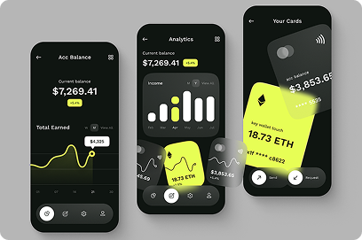
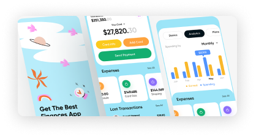

# 🌐 My Digital Agency

A modern **My Digital Agency** built with **React (Vite)** and **Tailwind CSS**, featuring reusable components, dynamic API integrations, and a clean responsive design.

---

## 🚀 Features

-   🎨 **Modern UI/UX** with Tailwind CSS and responsive layout.
-   🖼️ **Dynamic Banner & Hero Section** powered by API.
-   💼 **Services Showcase** – Displays services from API.
-   📂 **Featured & All Projects** – Portfolio/projects dynamically loaded.
-   👨‍👩‍👧‍👦 **Team Section** – Meet the people behind the agency.
-   💬 **Testimonials** – Client reviews and feedback.
-   📊 **Stats Section** – Company achievements and stats.
-   🔗 **Dynamic Social Links** – Managed through API.
-   📩 **Newsletter Subscribe** – Simple subscribe component.
-   🧭 **NotFound (404) Page** – Friendly error page for invalid routes.
-   📱 **Fully Responsive** – Works across desktop, tablet, and mobile.

---

## 📂 Project Structure

```

digital-agency
├── public
│ ├── icons/ # Static icons
│ ├── images/ # Project, services, testimonials, team images
│ └── vite.svg
├── src
│ ├── api/ # API service files
│ ├── assets/ # React assets (logos, svgs)
│ ├── components/ # Reusable UI components
│ ├── layout/ # Layout wrapper (MainLayout)
│ ├── pages/ # Page components (Home, Services, Projects, etc.)
│ ├── App.jsx # Root app component
│ ├── main.jsx # Vite entry point
│ └── index.css # Global styles
├── index.html # Root HTML file
├── package.json # Dependencies & scripts
└── vite.config.js # Vite configuration

```

---

## 🛠️ Tech Stack

-   **Frontend:** React (Vite)
-   **Styling:** Tailwind CSS
-   **Icons:** React Icons
-   **API Calls:** Axios
-   **Routing:** React Router DOM

---

## ⚙️ Installation & Setup

Clone the repository and install dependencies:

```bash
# Clone repo
git clone https://github.com/gitbugd20p/OS-TRN-B-5-F-Assignment-M-18.git

# Navigate to project
cd OS-TRN-B-5-F-Assignment-M-18

# Install dependencies
npm install

# Run development server
npm run dev
```

---

## 📡 API Endpoints Used

-   `/api/HeroListApi` → Hero section data
-   `/api/bannerBrandsApi` → Brand logos
-   `/api/allServiceApi` → Services
-   `/api/featuredProject` → Featured projects
-   `/api/allProjectApi` → All projects
-   `/api/allTeamApi` → Team members
-   `/api/allTestimonials` → Testimonials
-   `/api/statList` → Stats
-   `/api/allSocialLinkApi` → Social media links

---

## 🔗 Live Demo

-   🌍 **Live Website:** [https://your-live-link.netlify.app](https://your-live-link.netlify.app) _(replace with your actual deployed link)_
-   📦 **GitHub Repo:** [OS-TRN-B-5-F-Assignment-M-18](https://github.com/gitbugd20p/OS-TRN-B-5-F-Assignment-M-18)

---

## 📸 Screenshots

### 🏠 Home Page



### 💼 Services



---

## 📌 Roadmap

-   ✅ Dynamic API integration for social links
-   ✅ Reusable card components (Service, Project, Testimonial)
-   🚧 Dark mode support
-   🚧 Blog/Articles section

---

## 🤝 Contributing

Contributions are welcome! If you’d like to improve this project:

1. Fork the repository
2. Create a new branch (`feature/your-feature-name`)
3. Commit your changes
4. Push to your branch
5. Open a Pull Request

---

## 📜 License

This project is licensed under the **MIT License** – feel free to use it for your own projects.

---

## 👨‍💻 Author

Developed by **\[gitbugd20p]** ✨

---
